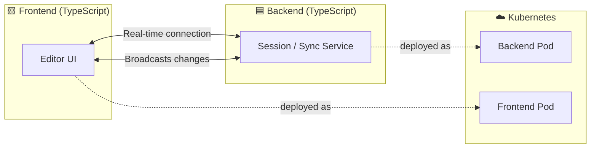

<div align="center">

# 💻 Collaborative Code Editor

**A Real-Time, Multi-User Code Editing Platform**

*Write code together, live — synced across every connected client.*

[](https://www.typescriptlang.org)
[](https://kubernetes.io)
[](https://www.cypress.io)
[](https://www.jetify.com/devbox)
[](#-license)

</div>

---

## 📑 Table of Contents

- [Overview](#-overview)
- [Features](#-features)
- [Architecture](#️-architecture)
- [Project Structure](#️-project-structure)
- [Getting Started](#-getting-started)
  - [Prerequisites](#prerequisites)
  - [Local Development](#local-development)
  - [Running Tests](#running-tests)
- [Deployment](#-deployment)
- [Tech Stack](#-tech-stack)
- [Roadmap](#️-roadmap)
- [Author](#-author)

---

## 📖 Overview

**Collaborative Code Editor** is a full-stack, real-time editing platform that lets multiple users write and edit code together in the same session — think of it as a self-hosted, lightweight alternative to tools like Replit or VS Code Live Share.

The project is built end-to-end in **TypeScript**, spanning both the backend service and the frontend client, and is designed from the ground up to be **container-native and Kubernetes-ready**, with a dedicated `K8s/` manifest set for cluster deployment.

---

## ✨ Features

- 🔄 **Real-Time Sync** — Edits from one user are reflected instantly for every other participant in the session.
- 🧩 **Full TypeScript Stack** — A single, consistent language across backend and frontend reduces friction and keeps the codebase cohesive.
- 🐳 **Cloud-Native by Design** — Ships with Kubernetes manifests for straightforward deployment to any cluster (including OpenShift-compatible environments).
- 🧪 **End-to-End Testing** — Cypress-driven E2E suite validates real collaborative workflows, not just unit-level behavior.
- ⚙️ **Reproducible Dev Environment** — `devbox.json` pins the exact toolchain so the project runs the same on every machine.
- 🛠️ **Task Automation** — A `Taskfile.yaml` centralizes common developer commands.
- 🤖 **CI Workflows** — GitHub Actions automate checks on every push via `.github/workflows`.

---

## ⚙️ Architecture



The **frontend** hosts the editor UI that users interact with directly. The **backend** manages sessions and propagates changes between connected clients in real time. Both are containerized and deployed as separate pods, orchestrated through the manifests in `K8s/`.

---

## 🗂️ Project Structure

```
colaborative_code_editor/
├── .github/workflows/   # CI pipelines (GitHub Actions)
├── E2E/cypress/         # End-to-end test suites
├── K8s/                 # Kubernetes deployment manifests
├── assets/              # Static/project assets
├── backend/             # TypeScript backend service
├── frontend/             # TypeScript frontend client
├── Taskfile.yaml         # Task automation commands
├── cypress.config.ts     # Cypress E2E configuration
├── devbox.json           # Reproducible dev environment definition
├── package.json          # Root workspace scripts
└── tsconfig.json         # TypeScript project configuration
```

---

## 🚀 Getting Started

### Prerequisites

- **Node.js** (LTS recommended)
- **npm**
- [**Devbox**](https://www.jetify.com/devbox) *(optional but recommended for a fully reproducible environment)*
- **Docker** / **Kubernetes CLI** *(only required for containerized deployment)*

### Local Development

Clone the repository:

```bash
git clone https://github.com/tekluabayneh/colaborative_code_editor.git
cd colaborative_code_editor
```

Install dependencies:

```bash
npm install
```

Run backend and frontend together in development mode:

```bash
npm run dev
```

This runs `dev-backend` and `dev-frontend` concurrently, using `concurrently` under the hood.

> If you use Devbox, run `devbox shell` first to drop into a preconfigured environment with the correct toolchain before installing dependencies.

### Running Tests

End-to-end tests are written with Cypress:

```bash
npx cypress open   # interactive runner
npx cypress run    # headless CI mode
```

---

## ☸️ Deployment

Kubernetes manifests for deploying the full application (backend + frontend) live under [`K8s/`](./K8s). At a high level:

```bash
kubectl apply -f K8s/
```

> Manifest contents (Deployments, Services, Routes/Ingress, etc.) may vary — check the `K8s/` directory for the current set of resources and adjust namespace, image references, and environment variables to match your cluster before applying.

---

## 🧰 Tech Stack

| Layer | Technology |
|---|---|
| Language | TypeScript (99.3% of codebase) |
| Frontend | TypeScript client (`frontend/`) |
| Backend | TypeScript service (`backend/`) |
| Testing | Cypress (E2E) |
| CI/CD | GitHub Actions |
| Orchestration | Kubernetes |
| Dev Environment | Devbox |
| Task Runner | Taskfile |

---

## 🗺️ Roadmap

- [ ] Syntax highlighting for multiple languages
- [ ] User presence indicators (live cursors, avatars)
- [ ] Session persistence and history
- [ ] Authentication and private rooms
- [ ] Production Helm chart

---

## 🧑‍💻 Author

**Teklu Abayneh**
*Full-Stack Engineer · Edge & Cloud-Native Systems*

[](https://github.com/tekluabayneh)

---

<div align="center">

*Code together. Ship together.*

</div>
